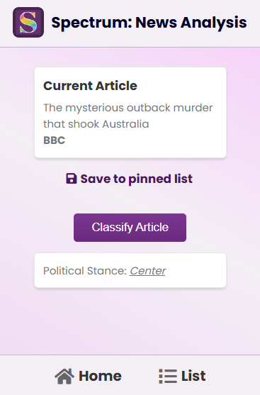
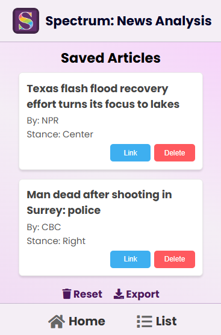

# 🌐 Spectrum – News Analysis Chrome Extension

Spectrum is a Chrome Extension that helps users understand the political standing of news articles from popular websites. By simply going to an article, Spectrum sends the article data to a hosted backend model that uses natural language processing, neural networks, and machine learning to identify the bias of the article and classify it as left/center/right.

Stay informed and understand the media landscape better with quick, reliable insights by using Spectrum today!
Visit the [GitHub Pages](https://zsspan.github.io/Spectrum/). 
Note Spectrum is currently awaiting aproval for the Chrome Web Store!

<div style="display: flex; gap: 10px;">
  
  
  
</div>


Features
--------

- Instant political bias classification of news articles
- Easy-to-use interface with keyword highlighting
- Pin and save articles for quick access later
- Seamless background analysis using hosted backend NLP models


Project Structure
-----------------

This repo is split into `docs`, `data`, `server`, and `src`.

- `docs`: contains the HTML/CSS for the GitHub Pages and privacy policy
- `data`: contains the training/testing Jupyter Notebook files, models, and CSVs. Note that due to GitHub storage constraints, some of the latest files are omitted.
- `server`: contains the backend routes to host the model. (Currently deployed on Render)
-  `src`: contains the client-side Chrome Extension files


Getting Started
---------------

1. Clone the repo:

   ```git clone https://github.com/yourusername/spectrum.git```

2. Load the extension:

   - Open chrome://extensions/
   - Enable Developer Mode
   - Click "Load Unpacked"
   - Select the `src/` directory

3. Run the backend (Flask):
   - You can opt to run the backend locally, but it is already hosted using Render!


Tech Stack
-------

- **Frontend:** Vanilla JS, HTML, CSS
- **Backend:** Python Flask
- **Machine Learning and NLP:** Jupyter Notebook, Scikit-Learn, TensorFlow, spaCy
- **Data:** Pandas, Seaborn
- **Hosting:** Render (BE), GitHub Pages (Static), AWS EC2 (Previously Used)

Note that the training data used for the model was an aggregate of multiple sources. This includes AllSites and other large sources.
